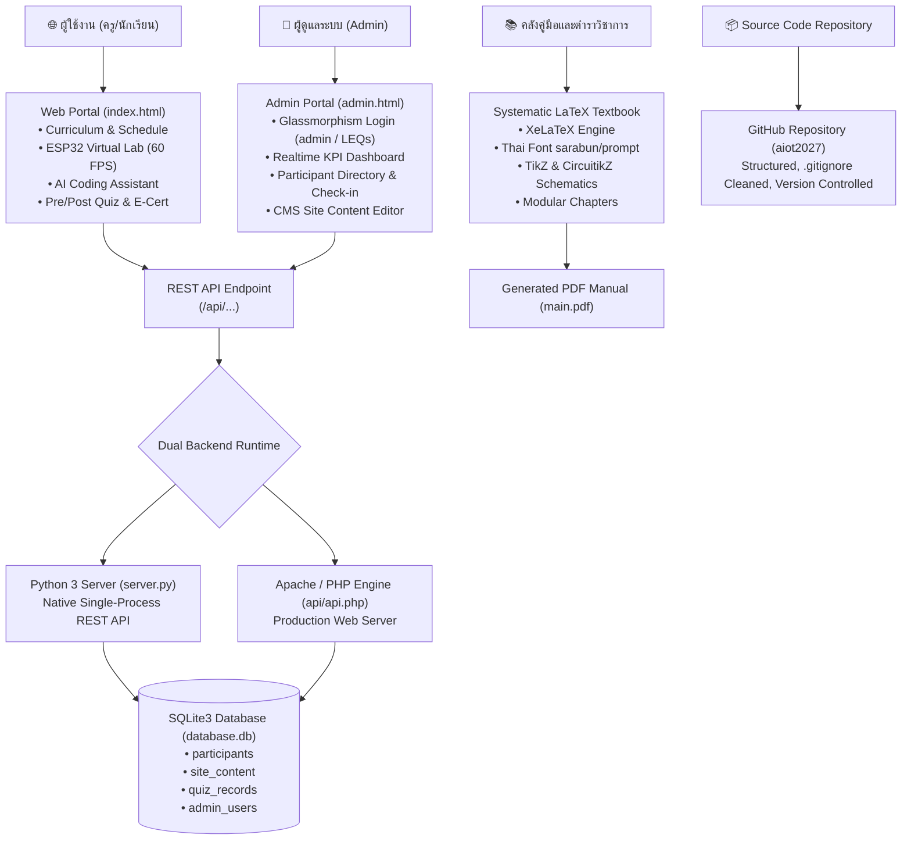

# 🚀 AIoT Fullstack Web, Database, Admin CMS & LaTeX Manual Architect

**AIoT Fullstack & LaTeX Architect** คือกรอบการทำงานระดับมืออาชีพที่รวบรวมมาตรฐานการออกแบบ พัฒนา และเชื่อมโยง 4 องค์ประกอบสำคัญของโครงการนวัตกรรมเทคโนโลยีและการศึกษาดิจิทัล:
1. **Frontend Web Portal**: พอร์ทัลกิจกรรมและคลังความรู้พร้อมแล็บจำลองเสมือนจริง (Virtual Lab) 60 FPS
2. **Dual-Runtime Backend & Database**: ฐานข้อมูล SQLite3 รองรับทั้ง Python HTTP Server และ Apache / XAMPP PHP
3. **Admin Management Portal (CMS)**: ระบบหลังบ้านสไตล์ Glassmorphism บริหารจัดการผู้สมัคร สถิติ เช็คอิน และเนื้อหาเพจ
4. **Systematic LaTeX Textbook & Manual**: ระบบเอกสารคู่มือและตำราวิชาการระดับ Masterclass ด้วย XeLaTeX และ CircuitikZ

---

## 🏛️ สถาปัตยกรรมระบบโดยรวม (System Overview)



---

## 💻 1. มาตรฐานการพัฒนา Frontend Web Portal

### 1.1 โครงสร้างโฟลเดอร์มาตรฐาน
```text
project_root/
├── index.html          # หน้าหลักพอร์ทัล (Single-Page Application Tabs)
├── admin.html          # ระบบจัดการหลังบ้าน (Admin Portal)
├── style.css           # Vanilla CSS Design System (Dark Space Theme)
├── app.js              # Vanilla JavaScript ควบคุม UI, Charts, Canvas, State
├── server.py           # Python 3 Backend + SQLite3 Native API
├── database.db         # ฐานข้อมูล SQLite3
├── api/
│   └── api.php         # Mirror PHP Backend สำหรับ Apache/XAMPP
└── assets/             # รูปภาพ, ไอคอน, สื่อประกอบ
```

### 1.2 การออกแบบส่วนติดต่อผู้ใช้ (Design System)
* **ชุดสี Dark Space Neon**:
  * Background: `#080d1a` และ `#0f172a`
  * Primary Emerald: `#10b981` (ความสำเร็จ/เกษตรอัจฉริยะ)
  * Secondary Cyan: `#38bdf8` (เทคโนโลยี/คลาวด์)
  * Accent Amber/Orange: `#f97316` (ระบบแจ้งเตือน/ฮาร์ดแวร์)
  * Glass Surface: `rgba(15, 23, 42, 0.75)` พร้อม `backdrop-filter: blur(16px)`
* **โมเดลฟุตเตอร์ 4 คอลัมน์ (ถอดแบบจาก `scirbru_praneet2026`)**:
  * คอลัมน์ 1: Brand Logo, ข้อมูลองค์กร และวิสัยทัศน์โครงการ
  * คอลัมน์ 2: เมนูหลัก (หน้าหลัก, ลงทะเบียน, รายชื่อ, AI Coding, Virtual Lab, เกียรติบัตร, Admin)
  * คอลัมน์ 3: ช่องทางติดต่อ (คณะ, มหาวิทยาลัย, เบอร์โทร, อีเมล, เว็บไซต์อาจารย์ผู้ประสานงาน)
  * คอลัมน์ 4: พิกัดศูนย์การเรียนรู้ (Google Maps Embed + ข้อมูลพิกัดและระบบตรวจวัด)
  * Sub-footer: แถบระบุลิขสิทธิ์ความร่วมมือ (Partners)
  * Mobile Bottom Nav: แถบนำทางด้านล่างแบบ Sticky สำหรับสมาร์ทโฟน

---

## 🗄️ 2. ระบบฐานข้อมูล SQLite3 & Dual-Backend

### 2.1 โครงสร้างตาราง (Database Schema)
```sql
-- 1. ตารางผู้สมัครเข้าร่วมอบรม
CREATE TABLE IF NOT EXISTS participants (
    id INTEGER PRIMARY KEY AUTOINCREMENT,
    reg_code TEXT UNIQUE,
    prefix TEXT,
    fullname TEXT NOT NULL,
    role TEXT DEFAULT 'student',
    school TEXT NOT NULL,
    grade_dept TEXT,
    phone TEXT,
    email TEXT,
    food_pref TEXT DEFAULT 'normal',
    status TEXT DEFAULT 'confirmed',
    checked_in INTEGER DEFAULT 0,
    created_at TIMESTAMP DEFAULT CURRENT_TIMESTAMP
);

-- 2. ตารางเนื้อหาเว็บไซต์แบบไดนามิก (CMS)
CREATE TABLE IF NOT EXISTS site_content (
    key TEXT PRIMARY KEY,
    value TEXT
);

-- 3. ตารางบันทึกผลคะแนนแบบทดสอบ (Pre-test / Post-test)
CREATE TABLE IF NOT EXISTS quiz_records (
    id INTEGER PRIMARY KEY AUTOINCREMENT,
    fullname TEXT NOT NULL,
    school TEXT,
    quiz_type TEXT NOT NULL,
    score INTEGER NOT NULL,
    total_questions INTEGER NOT NULL,
    answers_json TEXT,
    created_at TIMESTAMP DEFAULT CURRENT_TIMESTAMP
);

-- 4. ตารางผู้ดูแลระบบ (Admin Authentication)
CREATE TABLE IF NOT EXISTS admin_users (
    username TEXT PRIMARY KEY,
    password TEXT NOT NULL
);
```

### 2.2 มาตรฐานความปลอดภัยของ Admin Credentials
* บัญชีเริ่มต้นมาตรฐาน: **Username: `admin`** / **Password: `LEQs`**
* บันทึกแบบ Seed ตรวจสอบรหัสผ่านที่ตรงกันทั้งบน `server.py` และ `api/api.php`
* การตอบกลับ Token ชั่วคราวใน `sessionStorage` เพื่อป้องกันการเข้าถึงหน้าแดชบอร์ดโดยไม่ผ่านการยืนยันตัวตน

---

## 🔐 3. ระบบหลังบ้าน Admin Portal (ถอดแบบจาก `globe2026/admin_login.php`)

### 3.1 การ์ดล็อกอินสไตล์ Glassmorphism
* การ์ดโปร่งแสงพื้นขาวนวล `rgba(255, 255, 255, 0.96)` บนพื้นหลัง Deep Dark Space
* แถบแสงไล่ระดับ Gradient ด้านบนสุดของการ์ด
* วงกลมไอคอน Shield Avatar พร้อมแอนิเมชันกระจายแสง (Ping Animation)
* ช่อง Input พร้อมไอคอนกำกับด้านซ้าย (`fas fa-user`, `fas fa-lock`)
* ปุ่มสลับดู/ซ่อนรหัสผ่าน (Show/Hide Eye Toggle)
* ปุ่มส่งฟอร์มไล่สี Gradient พร้อมไอคอนลูกศร
* ลิงก์ **"← กลับสำหรับหน้าหลัก"** เชื่อมโยงกลับสู่หน้าแรก

### 3.2 แดชบอร์ดผู้ดูแลระบบ (Admin Console)
1. **📊 สถิติภาพรวม (Real-time KPIs)**:
   * ยอดผู้สมัครรวมเทียบความจุ (เช่น 60 ที่นั่ง)
   * สัดส่วนคุณครู vs นักเรียน
   * จำนวนสถานศึกษาที่เข้าร่วม
   * ยอดผู้เช็คอินหน้างานจริง
2. **👥 รายชื่อผู้สมัคร (Directory & Actions)**:
   * ค้นหาแบบเรียลไทม์ (Live Search) ตามชื่อ โรงเรียน หรือรหัสสมัคร
   * กรองตามประเภท (ครู/นักเรียน) และสถานะเช็คอิน
   * ปุ่มสลับสถานะเช็คอิน (Toggle Check-in) 1 คลิก
   * ปุ่มส่งออกรายชื่อเป็นไฟล์ **CSV** สำหรับเปิดใน Microsoft Excel
   * Modal เพิ่มรายชื่อผู้สมัครด้วยตนเอง (Manual Add)
   * ปุ่มลบข้อมูลพร้อมระบบยืนยัน (Confirmation Dialog)
3. **✍️ ระบบแก้ไขเนื้อหาเพจ (Dynamic CMS)**:
   * แก้ไขข้อความประกาศด่วน (Announcement Banner)
   * ปรับแก้ Hero Title, Subtitle, กำหนดการ และสถานที่จัดงาน
   * บันทึกข้อมูลลงฐานข้อมูล SQLite3 ทันทีโดยไม่ต้องแก้ไฟล์โค้ด HTML
4. **📝 ผลคะแนนแบบทดสอบ (Quiz Analytics)**:
   * แสดงคะแนน Pre-test และ Post-test ของผู้เข้าอบรมแต่ละท่านแบบเรียลไทม์

---

## 📚 4. สถาปัตยกรรมตำราและคู่มือวิชาการ LaTeX (LaTeX Manual Architect)

### 4.1 โครงสร้างโฟลเดอร์เอกสารตำรามาตรฐาน
```text
latex_textbook/
├── main.tex                 # รูทไฟล์หลักที่รวมบทและคำสั่งตั้งค่า
├── styles/
│   ├── preamble.tex         # ฟอนต์ Sarabun/Prompt, ขอบกระดาษ, สี, Hyperref
│   └── tcolorbox_styles.tex # กล่องเน้นข้อความ โค้ดตัวอย่าง นิยาม ทฤษฎี
├── frontmatter/
│   ├── cover.tex            # หน้าปก
│   ├── preface.tex          # คำนำ
│   └── toc.tex              # สารบัญและสารบัญรูปภาพ
├── chapters/
│   ├── ch01_aiot_overview.tex
│   ├── ch02_esp32_firmware.tex
│   ├── ch03_sensors_calibration.tex
│   ├── ch04_deep_learning_edge.tex
│   └── ch05_farm_dashboard.tex
├── figures/                 # แผนภาพเวกเตอร์ TikZ และ CircuitikZ
├── images/                  # รูปภาพคมชัดสูง (PNG/JPG)
└── backmatter/
    ├── references.bib       # แหล่งอ้างอิงทางวิชาการ (BibTeX)
    └── index.tex            # ดรรชนีคำศัพท์
```

### 4.2 การตั้งค่าภาษาไทยและฟอนต์มาตรฐาน (XeLaTeX Preamble)
```latex
\documentclass[11pt,a4paper,oneside]{book}
\usepackage{fontspec}
\usepackage{xunicode}
\usepackage{xltxtra}

% ตั้งค่าฟอนต์ภาษาไทยมาตรฐาน
\defaultfontfeatures{Mapping=tex-text}
\setmainfont{TH Sarabun New}
\newfontfamily\thaifont{TH Sarabun New}
\newfontfamily\codefont{JetBrains Mono}

% ตั้งค่าระยะขอบกระดาษตามมาตรฐานวิชาการ
\usepackage[top=2.54cm, bottom=2.54cm, left=3.81cm, right=2.54cm]{geometry}

% แพ็กเกจสำหรับวงจรอิเล็กทรอนิกส์และแผนภาพ
\usepackage{tikz}
\usepackage[siunitx]{circuitikz}
\usepackage{tcolorbox}
\tcbuselibrary{skins,breakable,listings}
```

### 4.3 สคริปต์คอมไพล์อัตโนมัติ (`build.sh`)
```bash
#!/bin/bash
echo "=== Building LaTeX Textbook with XeLaTeX ==="
xelatex -interaction=nonstopmode main.tex
makeindex main.idx
xelatex -interaction=nonstopmode main.tex
echo "=== PDF Build Complete: main.pdf ==="
```

---

## 🐙 5. การจัดเก็บและจัดการบน GitHub (Git Workflow)

### 5.1 ไฟล์ `.gitignore` มาตรฐานสำหรับโปรเจกต์ AIoT + LaTeX
```gitignore
# Python & Virtual Environments
__pycache__/
*.py[cod]
*$py.class
.venv/
env/

# Large Media Files (Over 100MB)
*.mp4
*.mov
*.avi
*.mkv

# LaTeX Build Artifacts
*.aux
*.log
*.toc
*.lof
*.lot
*.out
*.idx
*.ilg
*.ind
*.listing

# OS & IDE
.DS_Store
Thumbs.db
.vscode/
.idea/
```

### 5.2 ขั้นตอนการ Push ขึ้น GitHub
```bash
git init
git add README.md .gitignore scirbru_ydai2026/ latex_textbook/
git commit -m "feat: complete AIoT web portal, admin CMS, SQLite3 database, and LaTeX textbook"
git branch -M main
git remote add origin https://github.com/Tsanaphy2023/aiot2027.git
git push -u origin main
```
