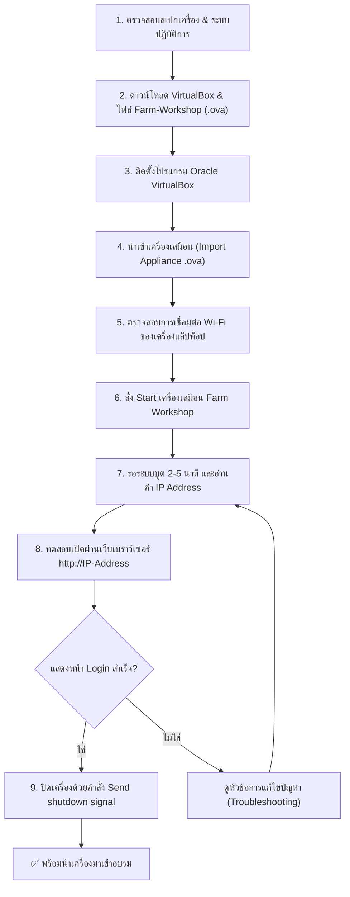

# 📖 คู่มือการติดตั้งและใช้งานเครื่องเสมือน Farm Workshop (Home Assistant)
### สำหรับผู้เริ่มต้นใช้งาน — โครงการอบรม IoT ในฟาร์มอัจฉริยะ (Smart Farm IoT)

---

## 📌 บทนำและวัตถุประสงค์

คู่มือฉบับนี้จัดทำขึ้นเพื่อให้ผู้เข้ารับการอบรมสามารถติดตั้งและเตรียมความพร้อมของระบบ **Home Assistant** ผ่านเครื่องเสมือน **Farm Workshop** บนแล็ปท็อปของตนเองได้อย่างถูกต้องเป็นขั้นตอน เพื่อให้พร้อมสำหรับการฝึกปฏิบัติต่ออุปกรณ์ IoT เซนเซอร์ และระบบควบคุมในวันอบรมจริง

> [!IMPORTANT]
> **ข้อกำหนดสำคัญก่อนวันอบรม:**
> * ต้องดำเนินการติดตั้งและทดสอบให้แล้วเสร็จจากที่บ้านก่อนเดินทางมาอบรม (ใช้เวลาประมาณ 20–30 นาที)
> * ไฟล์เครื่องเสมือนมีขนาดใหญ่ประมาณ **2.6 GB** ห้ามรอมาดาวน์โหลดที่สถานที่อบรม เนื่องจากความจุของเครือข่ายจะไม่เพียงพอหากดาวน์โหลดพร้อมกัน

---

## 💻 1. ข้อกำหนดของคอมพิวเตอร์ (System Requirements)

| รายการ | ความต้องการขั้นต่ำ | สเปกที่แนะนำ |
| :--- | :--- | :--- |
| **หน่วยความจำ (RAM)** | 8 GB ขึ้นไป | 16 GB ขึ้นไป |
| **พื้นที่ว่างบนดิสก์** | 20 GB ขึ้นไป | 30 GB ขึ้นไป (SSD) |
| **ระบบปฏิบัติการ** | Windows 10/11 (64-bit)<br>macOS (Intel หรือ Apple Silicon) | Windows 11 / macOS ล่าสุด |
| **อุปกรณ์ที่ไม่รองรับ** | ❌ Chromebook, iPad / Tablet, Windows ชิป ARM | — |

---

## 🗺️ 2. แผนผังขั้นตอนการทำงาน (Workflow Overview)



---

## 📥 3. แหล่งดาวน์โหลดโปรแกรมและไฟล์ (.ova)

โปรดเลือกลิงก์ดาวน์โหลดให้ตรงกับระบบปฏิบัติการของคอมพิวเตอร์ที่ท่านใช้งาน:

### 🪟 ก. สำหรับผู้ใช้ Windows (Intel / AMD 64-bit)
1. **โปรแกรม VirtualBox:** [ดาวน์โหลด VirtualBox for Windows Hosts](https://www.virtualbox.org/wiki/Downloads)
2. **ไฟล์เครื่องเสมือน:** [Farm-Workshop-win-1.2.ova (Google Drive)](https://drive.google.com/file/d/1DrX4O-jywvnCA0b4aqdQ3z9r7F2EkEf8/view?usp=sharing)
3. **โปรแกรมเสริม (กรณีติดตั้งแล้วเปิดไม่ขึ้น):** [Microsoft Visual C++ Redistributable (x64)](https://aka.ms/vs/17/release/vc_redist.x64.exe)

---

### 🍏 ข. สำหรับผู้ใช้ macOS ชิป Apple Silicon (M1 / M2 / M3 / M4)
> *วิธีตรวจเช็ก:* คลิกที่เมนู Apple () มุมซ้ายบน → เลือก **About This Mac** → ดูบรรทัด **Chip** หากขึ้นต้นด้วย Apple M1, M2, M3, M4 แสดงว่าเป็นรุ่นนี้
1. **โปรแกรม VirtualBox:** [ดาวน์โหลด VirtualBox 7.2+ for Apple Silicon](https://www.virtualbox.org/wiki/Downloads) *(เลือก macOS / Apple Silicon hosts)*
2. **ไฟล์เครื่องเสมือน:** [Farm-Workshop-arm64-1.2.ova (Google Drive Folder)](https://drive.google.com/drive/folders/1XiTigV52XVenZ8DhMZ6351dHOZvRHgMD)
   * *SHA256 Checksum:* `86a23d9e6c7b52928699ad25426c4e753aad8a0e739d5e77f2fe3f4c371450d0`

---

### 🍎 ค. สำหรับผู้ใช้ macOS ชิป Intel
1. **โปรแกรม VirtualBox:** [ดาวน์โหลด VirtualBox for macOS / Intel Hosts](https://www.virtualbox.org/wiki/Downloads)
2. **ไฟล์เครื่องเสมือน:** [Farm-Workshop-win-1.2.ova (Google Drive)](https://drive.google.com/file/d/1DrX4O-jywvnCA0b4aqdQ3z9r7F2EkEf8/view?usp=sharing)

---

## 🛠️ 4. ขั้นตอนการติดตั้งอย่างละเอียดทีละสเต็ป

### ขั้นตอนที่ 1: ติดตั้งโปรแกรม Oracle VirtualBox
1. ดับเบิลคลิกไฟล์ติดตั้ง VirtualBox ที่ดาวน์โหลดมา
   * **Windows:** ดับเบิลคลิกไฟล์ `.exe` → กด **Next** → **Yes** → **Install** จนจบกระบวนการ
   * **macOS:** ดับเบิลคลิกไฟล์ `.dmg` → ดับเบิลคลิกไอคอน **VirtualBox.pkg** → ทำตามขั้นตอนบนหน้าจอ ป้อนรหัสผ่านเครื่องหรือแตะ Touch ID
2. เมื่อติดตั้งเสร็จ ให้เปิดโปรแกรม **Oracle VirtualBox** ขึ้นมา

---

### ขั้นตอนที่ 2: นำเข้าไฟล์เครื่องเสมือน (Import Appliance)
1. ในหน้าต่างโปรแกรม VirtualBox ให้ไปที่เมนูด้านบน:
   * **File** → **Import Appliance...** (หรือกดปุ่มลัด `Ctrl + I` บน Windows / `Cmd + I` บน Mac)
2. คลิกที่ไอคอนแฟ้มสีเหลือง แล้วเลือกไฟล์ `.ova` ที่ดาวน์โหลดไว้:
   * สำหรับ Windows หรือ Mac Intel: เลือก `Farm-Workshop-win-1.2.ova`
   * สำหรับ Mac Apple Silicon: เลือก `Farm-Workshop-arm64-1.2.ova`
3. กดปุ่ม **Next** (ถัดไป)
4. จะปรากฏหน้าจอสรุปการตั้งค่าของเครื่องเสมือน (Appliance Settings):
   * ชื่อเครื่อง: `Farm Workshop`
   * CPU: `2 Core`
   * RAM: `2048 MB`
   * *ไม่ต้องแก้ไขค่าใด ๆ ให้ใช้ค่าเริ่มต้นตามที่กำหนดไว้*
5. กดปุ่ม **Finish** (หรือ **Import**)
6. รอแถบแสดงสถานะทำงานจนครบ 100% (ใช้เวลาประมาณ 1–3 นาที) เมื่อเสร็จสิ้นจะปรากฏชื่อเครื่อง **Farm Workshop** ทางฝั่งซ้ายของโปรแกรม

---

### ขั้นตอนที่ 3: ตรวจสอบการตั้งค่าการเชื่อมต่อเครือข่าย (Network Bridge)
เพื่อให้เครื่องเสมือนสามารถรับหมายเลข IP ในวงเดียวกับแล็ปท็อปและสมาร์ตโฟนได้:
1. คลิกขวาที่ชื่อเครื่อง **Farm Workshop** → เลือก **Settings** (การตั้งค่า)
2. เลือกแถบหัวข้อ **Network** (เครือข่าย)
3. ตรวจสอบที่ **Adapter 1**:
   * **Enable Network Adapter:** ต้องถูกติ๊กถูก ✅
   * **Attached to:** เลือกเป็น **Bridged Adapter**
   * **Name:** ตรวจสอบว่าเลือกการ์ด Wi-Fi ที่เรากำลังใช้งานอยู่ (เช่น บน Mac คือ `en0: Wi-Fi` หรือบน Windows คือ `Wi-Fi / Wireless Network Adapter`)
4. กดปุ่ม **OK**

---

### ขั้นตอนที่ 4: การเปิดเครื่องเสมือนและการตรวจสอบความพร้อม (First Boot)

> [!WARNING]
> **สำคัญมาก:** แล็ปท็อปของท่านต้องเชื่อมต่อเข้ากับเครือข่าย Wi-Fi ให้เรียบร้อย **ก่อนที่จะกดเปิดเครื่องเสมือน** เสมอ

1. คลิกเลือกเครื่อง **Farm Workshop** ในโปรแกรม VirtualBox
2. กดปุ่ม **Start** (ไอคอนรูปลูกศรสีเขียว)
3. หน้าต่างคอนโซลสีดำจะปรากฏขึ้นมาระหว่างที่ระบบปฏิบัติการกำลังบูต
4. **รอประมาณ 2–5 นาที** ระบบจะทำการโหลดบริการและรับหมายเลข IP อัตโนมัติ
5. เมื่อระบบพร้อมใช้งาน ให้สังเกตข้อความบนหน้าจอดำ:

```text
============================================================
Farm Workshop (Home Assistant OS)
============================================================

IPv4 addresses for enp0s3: 192.168.1.50/24    <-- (สำหรับ Windows / Mac Intel)
IPv4 addresses for enp0s8: 192.168.1.50/24    <-- (สำหรับ Mac Apple Silicon)

URL: http://192.168.1.50:8123  หรือ  http://192.168.1.50
============================================================
```

> [!NOTE]
> * ตัวเลข IP ในแต่ละสถานที่และแต่ละเครื่องจะไม่เหมือนกัน ให้นำ **ตัวเลขที่อยู่ก่อนเครื่องหมาย `/`** มาใช้งาน (เช่น `192.168.1.50` หรือ `10.100.2.x`)
> * บน Mac Apple Silicon บรรทัดนี้จะขึ้นต้นด้วย `enp0s8` แทน `enp0s3` ซึ่งใช้งานได้เหมือนกัน

---

### ขั้นตอนที่ 5: การทดสอบเข้าใช้งานผ่านเว็บเบราว์เซอร์
1. เปิดเว็บเบราว์เซอร์บนแล็ปท็อป (เช่น Google Chrome, Safari, Edge)
2. ในช่องพิมพ์ที่อยู่เว็บไซต์ ให้พิมพ์หมายเลข IP ของท่าน:
   ```text
   http://192.168.1.50
   ```
   *(เปลี่ยนตัวเลขเป็น IP จริงที่ปรากฏบนหน้าจอดำของท่าน)*
3. **ผลลัพธ์ที่ถูกต้อง:** หน้าจอจะแสดงหน้า **Login ของ Home Assistant**
   * 🎉 **ถือว่าผ่านขั้นตอนการเตรียมเครื่องเรียบร้อยแล้ว!**
   * ⚠️ **ยังไม่ต้องลงทะเบียนหรือเข้าระบบ:** ผู้สอนจะแจ้งชื่อผู้ใช้งาน (Username) และรหัสผ่าน (Password) ให้ในวันอบรม
4. **การทดสอบผ่านสมาร์ตโฟน:**
   * เชื่อมต่อสมาร์ตโฟนของท่านเข้ากับ Wi-Fi วงเดียวกันกับแล็ปท็อป
   * เปิดเบราว์เซอร์ในสมาร์ตโฟน แล้วพิมพ์ URL เดียวกัน
   * หากแสดงหน้า Login เหมือนกัน แสดงว่าพร้อมสำหรับการทดลองควบคุมฟาร์มผ่านมือถือในห้องอบรม

> [!CAUTION]
> **ข้อห้ามเด็ดขาด:** ห้ามพิมพ์เข้าผ่าน `http://homeassistant.local` เป็นอันขาด เพราะในห้องอบรมมีผู้เข้าร่วมหลายท่าน หากทุกคนใช้ชื่อนี้ ระบบเครือข่ายจะสับสนและชื่อจะชนกัน **ต้องใช้หมายเลข IP เสมอ**

---

### ขั้นตอนที่ 6: วิธีการปิดเครื่องเสมือนอย่างปลอดภัย (Safe Shutdown)

เพื่อป้องกันไม่ให้ฐานข้อมูลและไฟล์ระบบของเครื่องเสมือนเสียหาย เมื่อทดสอบเสร็จสิ้นให้ปิดเครื่องตามวิธีนี้เท่านั้น:

1. คลิกที่ปุ่มปิดหน้าต่างเครื่องเสมือน (ปุ่มกากบาทมุมขวาบนใน Windows หรือปุ่มสีแดงมุมซ้ายบนใน Mac)
2. จะมีหน้าต่างถามตัวเลือกการปิด ให้เลือก:
   * 🔘 **Send the shutdown signal** (ส่งสัญญาณปิดระบบ)
3. กดปุ่ม **OK**
4. หน้าต่างเครื่องเสมือนจะค่อย ๆ ปิดตัวเองลงอย่างถูกต้อง


> [!CAUTION]
> **คำเตือน:** 
> * ❌ **ห้ามเลือก "Power off the machine"** เพราะเปรียบเสมือนการดึงปลั๊กไฟออกทันที อาจทำให้ไฟล์เสียหายจนต้อง Import ใหม่อีกรอบ
> * ❌ **ไม่ต้องเลือก "Save the machine state"** เพราะอาจทำให้เกิดปัญหาเรื่องการอัปเดตหมายเลข IP เมื่อเปลี่ยนสถานที่เชื่อมต่อ Wi-Fi

---

## 🎒 5. รายการสิ่งที่ต้องเตรียมมาในวันอบรม (Checklist)

- [ ] แล็ปท็อปที่ติดตั้ง VirtualBox และนำเข้าเครื่องเสมือน Farm Workshop เรียบร้อยแล้ว
- [ ] สายชาร์จ / อะแดปเตอร์จ่ายไฟของแล็ปท็อป (แนะนำให้พกปลั๊กพ่วงส่วนตัวมาด้วย)
- [ ] สมาร์ตโฟนที่สามารถเชื่อมต่อ Wi-Fi ได้ (สำหรับใช้ทดสอบควบคุมระบบ)
- [ ] เมาส์ (แนะนำเพื่อให้ทำงานได้สะดวกและรวดเร็วยิ่งขึ้น)
- [ ] **ห้ามลบ** ไฟล์หรือเครื่อง Farm Workshop ออกจากโปรแกรมเด็ดขาด

---

## ❓ 6. การแก้ไขปัญหาที่พบบ่อย (Troubleshooting)

### ปัญหาที่ 1: เลข IP ไม่แสดง หรือได้เลขที่ขึ้นต้นด้วย `169.254.x.x`
* **สาเหตุ:** แล็ปท็อปไม่ได้เชื่อมต่อ Wi-Fi ก่อนเปิดเครื่องเสมือน หรือการ์ดเครือข่ายเลือกผิดตัว
* **วิธีแก้ไข:**
  1. ปิดเครื่องเสมือน (Send shutdown signal)
  2. เชื่อมต่อ Wi-Fi ของแล็ปท็อปให้เชื่อมต่ออินเทอร์เน็ตได้ก่อน
  3. ไปที่ VirtualBox → คลิกขวาที่ `Farm Workshop` → **Settings** → **Network**
  4. ตรวจสอบว่าเลือก **Bridged Adapter** และเลือกชื่อการ์ด Wi-Fi ที่ถูกต้อง (เช่น `en0: Wi-Fi`)
  5. กด Start เปิดเครื่องใหม่อีกครั้ง

### ปัญหาที่ 2: พิมพ์หมายเลข IP ในเบราว์เซอร์แล้วหน้าเว็บหมุนค้าง (ไม่ขึ้นหน้า Login)
* **สาเหตุ:** พิมพ์พอร์ตผิด หรือไม่ได้พิมพ์ `http://` นำหน้า
* **วิธีแก้ไข:**
  1. ให้ลองระบุพอร์ต `:8123` ต่อท้าย เช่น `http://192.168.1.50:8123`
  2. ตรวจสอบให้แน่ใจว่าพิมพ์ `http://` ไม่ใช่ `https://`
  3. ตรวจสอบว่าแล็ปท็อปไม่ได้เปิดโปรแกรม VPN ทำงานอยู่ (หากมี ให้กด Disconnect ชั่วคราว)

### ปัญหาที่ 3: (Windows) เปิดโปรแกรม VirtualBox แล้วขึ้นข้อผิดพลาดหรือรัน VM ไม่ได้
* **สาเหตุ:** ขาดชุดไลบรารี Microsoft Visual C++
* **วิธีแก้ไข:**
  * ดาวน์โหลดและติดตั้ง [vc_redist.x64.exe](https://aka.ms/vs/17/release/vc_redist.x64.exe) จากนั้นรีสตาร์ตคอมพิวเตอร์ 1 รอบ

### ปัญหาที่ 4: (macOS Apple Silicon) VirtualBox แจ้งเรื่อง System Extension ถูกบล็อก
* **สาเหตุ:** กลไกความปลอดภัยของ macOS กำหนดให้ผู้ใช้กดยินยอม
* **วิธีแก้ไข:**
  1. ไปที่ **System Settings** (การตั้งค่าระบบ) → **Privacy & Security** (ความเป็นส่วนตัวและความปลอดภัย)
  2. เลื่อนลงมาด้านล่าง มองหาหัวข้อ Security และคลิกปุ่ม **Allow** สำหรับ Oracle
  3. ทำตามคำแนะนำบนหน้าจอเพื่อยืนยัน

---

*จัดทำขึ้นสำหรับการอบรมเชิงปฏิบัติการ Smart Farm IoT เพื่อการเกษตรแม่นยำและระบบควบคุมอัจฉริยะ*
